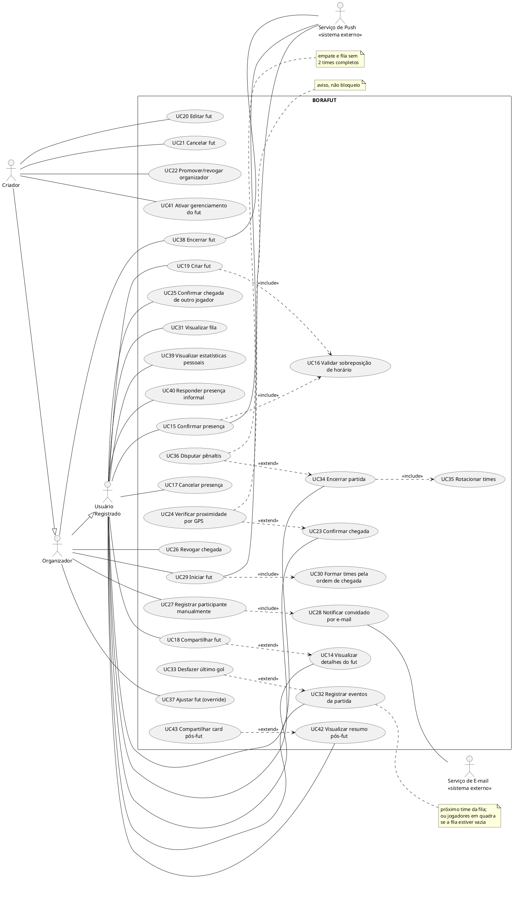

# Especificação dos diagramas para a banca - v2.1 (11/06/2026; revisada em 13/07/2026)

> **v2 substitui integralmente a v1.** Mudanças: papéis renomeados (Criador/Organizador,
> conforme `fut_in_app_context.md` §2), casos de uso do fluxo completo (não-gerenciado,
> ativação de gerenciamento, pós-fut, overrides), MER com `log_chegada`/timestamps/
> snapshots (migration do KAN-46) e NOVA seção C4 nível componentes (C3) para o Cap. 6.
> Divisão de trabalho decidida em 11/06: casos de uso e C4 gerados via PlantUML/C4-PlantUML
> (saída de ferramenta, notação padrão); MER conceitual (Chen) e lógico desenhados pelo
> Miguel no brModelo.
> Fontes: `fut_in_app_context.md` (integral), `borafut_contexto_prd.md` (pós-sync de
> 11/06), `BoraFut-Backend/prisma/schema.prisma` + `seed.ts`, apêndice de US da monografia,
> `analises-2026-06-11/04-plano-tcc-v2.md` (P07b, P20, D06, D07).
>
> **Revisão v2.1 (13/07/2026), após auditoria do código:**
> - UC/C4 renderizados e inseridos no Cap5; a spec dos UCs continua fiel ao produto.
> - Seção 4 (C3): coluna "Estado" atualizada — os módulos reais do backend batem com o
>   desenho (`auth`, `courts`(+reviews), `futs`, `presence`, `match`, `realtime`, `push`
>   +`email`, `scheduler`, `prisma`, `common`); ponto em aberto 4 RESOLVIDO.
> - Ponto em aberto 2 RESOLVIDO: status inativo de AVALIACAO no código é **'INATIVA'**
>   (default 'ATIVA').
> - MER (seção 2): continua pendente de desenho pelo Miguel. Escopo (DECISÃO 13/07,
>   revoga a baseline congelada): o **modelo lógico e o dicionário refletem o schema
>   COMPLETO atual** — incluindo `fut_notificacao`, `push_receipt`,
>   `fut.motivo_sistema`/`inatividade_reiniciada_em`/`event_seq`,
>   `jogador.expo_push_token`, `participacao.removido_por_admin` e
>   `log_partida.time`/`referencia_log_id`. No conceitual (Chen), REGISTRO DE
>   NOTIFICAÇÃO entra como entidade fraca de FUT; RECIBO DE PUSH fica a critério do
>   desenho (não se relaciona com entidade de domínio — o vínculo é o valor do token).
>   O dicionário do apêndice precisa ser REGERADO do schema atual (sessão P20).
> - Fluxo novo implementado que NÃO está nos diagramas: **sucessão de criador** (criador
>   sai/cancela → papel transferido a sucessor indicado ou por senioridade). Decidir se
>   vira fluxo alternativo textual de UC17/UC21 (recomendado: só texto, sem re-render) —
>   registrado na seção 5.

---

## 1. DIAGRAMA DE CASOS DE USO (UML)

**Estrutura final: TRÊS diagramas** (validada por renderização em 11/06 - acima de ~15
elipses o layout degrada): Diagrama I "Conta, mapa e quadras" (grupos A-B), Diagrama II
"Fut: organização e presença" (grupo C) e Diagrama III "Partida, não-gerenciado e pós-fut"
(grupos D-E). Todos repetem a fronteira BORAFUT e os atores pertinentes.

**Status: RENDERIZADOS.** Fontes em `latex/figuras/diagramas-src/*.puml`; PNGs verificados
em `latex/figuras/diagramas-src/render/` (uc-conta-mapa, uc-fut-organizacao,
uc-fut-partida, c4-conteineres, c4-componentes). Para re-renderizar:
`java -jar plantuml.jar -tpng -charset UTF-8 -graphvizdot <caminho do dot.exe> -o render *.puml`
(PlantUML jar + Graphviz portátil; a extensão PlantUML do VS Code também funciona).
MER conceitual e lógico: brModelo, manual (seção 2).

### 1.1 Atores e hierarquia

| Ator | Tipo | Descrição | Fonte |
|---|---|---|---|
| Usuário Não Registrado | Humano (base) | Explora mapa e informações públicas de quadras; abre rota; não vê detalhes de futs | contexto §2 (Visitante) |
| Usuário Registrado | especializa Não Registrado | Conta ativa: presença, chegada, favoritos, avaliação, criação de fut, estatísticas | contexto §2 |
| Organizador | especializa Usuário Registrado | Participante promovido pelo criador; permissões operacionais do fut (gerir chegadas, fila, partida, cadastro manual) | fut_in_app §2, §3.7 |
| Criador | especializa Organizador | Quem criou o fut; autoridade máxima: tudo do organizador MAIS editar/cancelar o fut, promover/revogar organizadores, ativar gerenciamento | fut_in_app §2, §3.7 |
| Serviço de E-mail | externo (Amazon SES) | Código de verificação e convites | contexto §6 |
| Serviço de Mapas | externo (Google Maps) | Mapa, geolocalização, rota | contexto §6 |
| Serviço de Push | externo (Expo Push) | Lembretes e avisos | contexto §6; fut_in_app §3.8/§8.5 |

**Generalização (setas de triângulo vazado, do filho para o pai):**

```
Criador ──▷ Organizador ──▷ Usuário Registrado ──▷ Usuário Não Registrado
```

Justificativa: cada nível pode tudo que o anterior pode. O Organizador NÃO pode mexer no
criador nem em outros organizadores (fut_in_app §3.7) - essa exceção fica nas
especificações textuais, não no diagrama (generalização modela capacidade, e as ações
exclusivas do criador estão associadas só a ele).

### 1.2 Casos de uso

Ator indicado = nível MAIS BAIXO da hierarquia com acesso (os acima herdam).
NR = Não Registrado, R = Registrado, O = Organizador, C = Criador.

**Grupo A - Conta e acesso** (Diagrama I)

| ID | Caso de uso | Ator | Origem |
|---|---|---|---|
| UC01 | Cadastrar-se | NR | E1-F1-US1/US2 |
| UC02 | Autenticar-se | R | E1-F2-US1/US2; RF01 |
| UC03 | Validar código por e-mail | (incluído; assoc. Serviço de E-mail) | E1-F1-US2, E1-F2-US1 |
| UC04 | Encerrar sessão | R | E1-F2-US3 |
| UC05 | Gerenciar conta e privacidade | R | E1-F3-US1/US2/US3 |
| UC06 | Atualizar e-mail | R | E1-F1-US3 |
| UC07 | Gerenciar perfil | R | E6-F1-US1/US2 |

**Grupo B - Mapa e quadras** (Diagrama I)

| ID | Caso de uso | Ator | Origem |
|---|---|---|---|
| UC08 | Explorar mapa de quadras | NR | E2-F1; RF02; contexto §2 |
| UC09 | Filtrar quadras no mapa | NR | E2-F2 (filtro por favoritas exige conta - fluxo alternativo) |
| UC10 | Visualizar perfil da quadra | NR | E3-F1/F2 (agenda detalhada bloqueada p/ visitante - fluxo alternativo) |
| UC11 | Avaliar quadra | R | E3-F1-US3; elegibilidade fut_in_app §6.3 (pré-condição textual) |
| UC12 | Favoritar quadra | R | E3-F3-US1 |
| UC13 | Traçar rota até a quadra | **NR** | contexto §2 item 4 (visitante PODE abrir rota) - RESOLVE a dúvida da v1; atualizar US E3-F3-US2 no apêndice (ação NV2 do plano) |

**Grupo C - Fut: pré-fut e presença** (Diagrama II)

| ID | Caso de uso | Ator | Origem |
|---|---|---|---|
| UC14 | Visualizar detalhes do fut | **R** | contexto §2 (detalhes de fut BLOQUEADOS p/ visitante) - RESOLVE a dúvida da v1 |
| UC15 | Confirmar presença | R | E4-F2-US1; fut_in_app §3.2 |
| UC16 | Validar sobreposição de horário | (incluído) | fut_in_app §3.3 (janela <2h; roda SEMPRE ao confirmar presença E ao criar fut) |
| UC17 | Cancelar presença | R | E4-F2-US2 |
| UC18 | Compartilhar fut (convite por link) | R | E4-F3-US1; fut_in_app §3.6 |
| UC19 | Criar fut | R | E5-F1-US1; fut_in_app §3.1 (quem cria torna-se Criador) |
| UC20 | Editar fut | C | E5-F1-US2 (só criador, só agendado) |
| UC21 | Cancelar fut | C | E5-F1-US3; fut_in_app §3.5 |
| UC22 | Promover/revogar organizador | C | fut_in_app §3.7 (NOVO - sem US; cobrir no NV2) |
| UC23 | Confirmar chegada | R | E5-F2-US1; fut_in_app §4.1 |
| UC24 | Verificar proximidade por GPS | (extensão) | fut_in_app §4.1 (aviso, não bloqueio) |
| UC25 | Confirmar chegada de outro jogador | R {que já chegou} | fut_in_app §4.1 (testemunha presencial) (NOVO) |
| UC26 | Revogar chegada | O | fut_in_app §4.1 (anti-furo) (NOVO) |
| UC27 | Registrar participante manualmente | O | E5-F2-US2; fut_in_app §3.4 (SÓ durante o fut) |
| UC28 | Notificar convidado por e-mail | (incluído; assoc. Serviço de E-mail) | E5-F2-US3 |

**Grupo D - Fut gerenciado: partida** (Diagrama II)

| ID | Caso de uso | Ator | Origem |
|---|---|---|---|
| UC29 | Iniciar fut | O | fut_in_app §4.3 (pré: horário E mínimo de jogadores) |
| UC30 | Formar times pela ordem de chegada | (incluído) | fut_in_app §4.3/§4.4; RF05 |
| UC31 | Visualizar fila | R | E5-F3-US1; fut_in_app §4.2 |
| UC32 | Registrar eventos da partida (gol, gol contra, pausa/retomada) | R {próximo time da fila, ou em quadra se fila vazia} | fut_in_app §4.6.1-4.6.4 - RESOLVE a dúvida da v1 (regra explícita) |
| UC33 | Desfazer último gol | (extensão) | fut_in_app §4.6.3 (janela 15s) (NOVO) |
| UC34 | Encerrar partida | R {mesma regra de UC32} | fut_in_app §4.7.1/§4.11 (último lance) |
| UC35 | Rotacionar times | (incluído) | fut_in_app §4.13 (regra unificada) |
| UC36 | Disputar pênaltis | (extensão) | fut_in_app §4.12 (condição: empate e fila sem 2 times completos) |
| UC37 | Ajustar fut - override | O | fut_in_app §4.5/§4.14 (trocar jogador, mover na fila, remover, forçar encerramento) - agrupado em 1 UC para legibilidade; detalhar nas specs textuais |
| UC38 | Encerrar fut | O | fut_in_app §4.15.1 |
| UC39 | Visualizar estatísticas pessoais | R | E5-F6-US1; fut_in_app §6.2 |

**Grupo E - Não-gerenciado e pós-fut** (Diagrama II)

| ID | Caso de uso | Ator | Origem |
|---|---|---|---|
| UC40 | Responder presença informal | R | fut_in_app §5.2.1 (popup "você está na quadra?") (NOVO) |
| UC41 | Ativar gerenciamento do fut | C | fut_in_app §5.3 (tela "Quem está aqui?"; unidirecional) (NOVO) |
| UC42 | Visualizar resumo pós-fut | R | fut_in_app §6.1 (card gerenciado; tela informativa não-gerenciado) (NOVO) |
| UC43 | Compartilhar card pós-fut | R | fut_in_app §6.1.3 (share sheet) (NOVO) |

Exclusões deliberadas (registrar em legenda/specs, não desenhar): modo claro/escuro
(preferência de UI), validação de telefone (fora do MVP), coleta pós-fut por stepper
(variação de UC40 - fluxo alternativo textual).

### 1.3 Include e extend

Setas tracejadas; include do BASE para o INCLUÍDO; extend da EXTENSÃO para o BASE.

| Tipo | De | Para | Condição/justificativa | Fonte |
|---|---|---|---|---|
| include | UC01 Cadastrar-se | UC03 Validar código | sempre | E1-F1-US2 |
| include | UC02 Autenticar-se | UC03 Validar código | sempre (passwordless) | E1-F2-US1 |
| include | UC06 Atualizar e-mail | UC03 Validar código | sempre (código no novo endereço) | E1-F1-US3 |
| include | UC15 Confirmar presença | UC16 Validar sobreposição | sempre roda (sucesso ou 409) | fut_in_app §3.3 |
| include | UC19 Criar fut | UC16 Validar sobreposição | criador entra confirmado; mesma validação | fut_in_app §3.3 |
| include | UC27 Registrar participante manualmente | UC28 Notificar por e-mail | convidado sempre recebe e-mail | E5-F2-US3 |
| include | UC29 Iniciar fut | UC30 Formar times | sempre forma os 2 times iniciais | fut_in_app §4.3 |
| include | UC34 Encerrar partida | UC35 Rotacionar times | rotação sempre se aplica ao encerrar (caso "0 na fila" = rotação degenerada, mesma regra) | fut_in_app §4.13 |
| extend | UC09 Filtrar quadras | UC08 Explorar mapa | opcional (usuário aciona filtros) | E2-F2 |
| extend | UC13 Traçar rota | UC10 Visualizar quadra | opcional (botão "Como chegar") | contexto §2 |
| extend | UC18 Compartilhar fut | UC14 Visualizar fut | opcional (decide convidar) | E4-F3-US1 |
| extend | UC24 Verificar proximidade GPS | UC23 Confirmar chegada | condicional (permissão de localização; aviso, nunca bloqueio) | fut_in_app §4.1 |
| extend | UC33 Desfazer último gol | UC32 Registrar eventos | condicional (janela de 15s após gol) | fut_in_app §4.6.3 |
| extend | UC36 Disputar pênaltis | UC34 Encerrar partida | condicional (empate E fila < 2 times completos) | fut_in_app §4.12 |
| extend | UC43 Compartilhar card | UC42 Visualizar resumo pós-fut | opcional; só fut gerenciado gera card | fut_in_app §6.1 |

NÃO ligar casos autenticados a UC02 com include (sessão persiste); autenticação é
pré-condição textual. A hierarquia de atores já comunica o nível de acesso.

### 1.4 Associações e cardinalidades

Padrão: ator [1] - [0..*] caso de uso. Anotar nas associações principais dos atores
humanos. Atores externos como secundários (lado direito): Serviço de E-mail - UC03, UC28;
Serviço de Mapas - UC08, UC13; Serviço de Push - UC15, UC29, UC38 (lembretes/avisos;
US de notificação a criar - NV1/NV2 do plano). Convenção: humanos à esquerda, externos à
direita com estereótipo `<<sistema externo>>`.

### 1.5 Layout

- **Diagrama I (Conta, mapa e quadras):** fronteira BORAFUT ao centro; à esquerda, NR no
  topo e R abaixo (seta de generalização R→NR); faixa superior interna: UC08-UC10, UC01,
  UC13; faixa inferior: UC02-UC07, UC11, UC12; UC03 encostado à direita perto do Serviço
  de E-mail; Serviço de Mapas à direita no topo.
- **Diagrama II (Fut):** à esquerda, de cima para baixo, R → O → C (generalizações
  O→R e C→O; R repete-se do Diagrama I - anotar "ator definido no Diagrama I" se a
  ferramenta permitir, ou repetir a cadeia completa); faixas internas por grupo: pré-fut
  (UC14-UC22) no topo, chegada/fila (UC23-UC28) ao meio, partida (UC29-UC39) abaixo,
  não-gerenciado/pós-fut (UC40-UC43) na base; Serviço de E-mail e Push à direita.
- Notas (UML comment) apenas em: UC32/UC34 ("{próximo time da fila; ou jogadores em quadra
  se a fila estiver vazia}"), UC24 ("aviso, não bloqueio") e UC36 (condição de pênaltis).

### 1.6 Fonte PlantUML (Diagrama II - o mais denso; Diagrama I segue o mesmo padrão)



---

## 2. MER CONCEITUAL (notação de Chen) - v2

Ferramenta: brModelo (desenho manual do Miguel). Notação: entidade = retângulo; fraca =
retângulo duplo; relacionamento = losango (identificador = duplo); atributo = elipse
(identificador sublinhado; multivalorado = elipse dupla; composto = sub-elipses);
cardinalidades 1/N/M nas linhas.

### 2.1 Conceitual × lógico (texto-base para a monografia)

Inalterado da v1 (tabela comparativa + 7 decisões de abstração), com 3 acréscimos:
- `log_chegada` vira a entidade fraca REGISTRO DE CHEGADA (evento de domínio: chegadas,
  revogações, presenças informais, cadastros presenciais).
- `fut_notificacao` vira a entidade fraca REGISTRO DE NOTIFICAÇÃO (pushes agendados do
  fut já enviados: lembretes, avisos de inatividade, cancelamento). `push_receipt` entra
  no lógico e no dicionário; no conceitual fica a critério do desenho (sem relacionamento
  com entidade de domínio).
- A tabela de telemetria `evento_produto` (instrumentação do beta, card 6) NÃO entra
  (não existe no schema; se for implementada, reavaliar).

### 2.2 Entidades e atributos

**JOGADOR** - id (ID); email (único); nome, apelido, dataNascimento, telefone, genero,
regiao, avatar, ativo; {tiposFutPreferidos} multivalorado. [schema Jogador]

**QUADRA** - id (ID); slug (único); nome, endereco, observacao; localizacao (composto:
latitude, longitude); nivelPiso, tipoIluminacao, nivelMovimentacao, nivelQualidade,
tamanho (domínios enumerados do schema); {fotos} multivalorado. [schema Quadra/FotoQuadra]

**FUT** - id (ID); codigoCompartilhamento (único); dataHora; descricao; status {agendado,
em_andamento, encerrado, cancelado}; gerenciadoPeloApp; minimoJogadores; regrasPadrao
(composto: tempoPartidaMinutos, golsParaVencer, tamanhoPorTime). [schema Fut + fut_in_app §3.1]

**PARTIDA** (fraca de FUT) - inicio (discriminador); fim; tempoPausado; status
{em_andamento, pausada, encerrada, em_penaltis, encerrada_provisoriamente};
regrasAplicadas (composto: tempoPartidaMinutos, golsParaVencer - snapshot copiado do fut
na criação). [fut_in_app §7.1]

**EVENTO DE PARTIDA** (fraca de PARTIDA) - dataHora (discriminador); tipo {gol, gol_contra,
gol_desfeito, pausa, retomada, encerramento_partida, penalti_gol, penalti_erro,
edicao_regras}; time (1 ou 2, do autor no momento do registro). [fut_in_app §7.3]

**REGISTRO DE CHEGADA** (fraca de FUT) - dataHora (discriminador); evento {chegou,
revogado_admin, revogado_self, presenca_informal, cadastro_manual}; gpsValidado.
[fut_in_app §7.2]

**REGISTRO DE NOTIFICAÇÃO** (fraca de FUT) - tipo (discriminador: lembrete_24h,
lembrete_1h, lembrete_horario, inatividade_aviso, inatividade_aviso_final,
nao_gerenciado_aviso, nunca_iniciado_cancelado); enviadaEm. [fut_in_app §7.5]

**AVALIACAO** - id (ID); nota; comentario; status {ATIVA, INATIVADA - a confirmar nome
exato}; data. [schema AvaliacaoQuadra]

### 2.3 Relacionamentos

| # | A | losango | B | Card. | Atributos do relacionamento | Fonte |
|---|---|---|---|---|---|---|
| R1 | JOGADOR | **cria** | FUT | 1:N | - (papel: criador) | Fut.criadorId (pós-KAN-46) |
| R2 | QUADRA | sedia | FUT | 1:N | - | Fut.quadraId |
| R3 | JOGADOR | participa | FUT | N:M | status {confirmado, cancelado, chegou, saiu}; organizador (booleano); confirmadoEm; canceladoEm; chegouEm; saiuEm | participacao + KAN-46 |
| R4 | JOGADOR | aguarda na fila de | FUT | N:M | posicao | lista |
| R5 | FUT | gera | PARTIDA | 1:N identificador | - | partida |
| R6 | JOGADOR | atua em | PARTIDA | N:M | time | jogador_partida |
| R7 | PARTIDA | registra | EVENTO DE PARTIDA | 1:N identificador | - | log_partida |
| R8 | JOGADOR | protagoniza | EVENTO DE PARTIDA | 1:N | (papel: autor) | log_partida.autorId |
| R9 | JOGADOR | lança | EVENTO DE PARTIDA | 1:N | (papel: registrador) | log_partida.registradorId |
| R10 | EVENTO DE PARTIDA | **desfaz** | EVENTO DE PARTIDA | 1:1 parcial (auto-relacionamento) | - (só gol_desfeito→gol no MVP) | referencia_log_id (KAN-46) |
| R11 | FUT | ocorre chegada em | REGISTRO DE CHEGADA | 1:N identificador | - | log_chegada.futId |
| R12 | JOGADOR | é alvo de | REGISTRO DE CHEGADA | 1:N | (papel: jogador) | log_chegada.jogadorId |
| R13 | JOGADOR | efetua | REGISTRO DE CHEGADA | 1:N | (papel: ator; ator≠jogador = confirmação por terceiro/ação administrativa) | log_chegada.atorId |
| R14 | JOGADOR | escreve | AVALIACAO | 1:N | - | avaliacao_quadra |
| R15 | AVALIACAO | refere-se a | QUADRA | N:1 | - | avaliacao_quadra |
| R16 | JOGADOR | curte | AVALIACAO | N:M | dataCurtida | curtida_avaliacao_quadra |
| R17 | JOGADOR | favorita | QUADRA | N:M | dataFavoritado | favorito_quadra |
| R18 | FUT | notifica | REGISTRO DE NOTIFICAÇÃO | 1:N identificador | - | fut_notificacao (UNIQUE fut+tipo) |

Participação total: FUT em R1/R2; PARTIDA em R5; EVENTO em R7/R8/R9; REGISTRO DE CHEGADA
em R11/R12/R13; REGISTRO DE NOTIFICAÇÃO em R18; AVALIACAO em R14/R15. Demais parciais.

### 2.4 Layout (brModelo)

JOGADOR à esquerda (entidade mais conectada); FUT ao centro com os losangos cria/participa/
aguarda empilhados entre JOGADOR e FUT; QUADRA à direita (sedia); AVALIACAO no topo entre
JOGADOR e QUADRA (escreve/refere-se a/curte; favorita por rota paralela); PARTIDA (duplo)
abaixo de FUT (gera duplo); EVENTO DE PARTIDA (duplo) abaixo de PARTIDA com auto-laço
"desfaz"; REGISTRO DE CHEGADA (duplo) abaixo-esquerda de FUT, com dois losangos para
JOGADOR (é alvo de / efetua - escrever os papéis nas linhas). Domínios enumerados podem
ir em legenda lateral para não poluir. Cardinalidades em notação Chen (1, N, M), sem
pé-de-galinha.

### 2.5 Modelo lógico (atualização) e dicionário

O lógico (brModelo ou equivalente) reflete o **schema completo atual** do
`BoraFut-Backend/prisma/schema.prisma`: renames (criador_id, participacao.organizador),
colunas novas (confirmado_em/cancelado_em/chegou_em/saiu_em, removido_por_admin;
partida.tempo_partida_minutos/gols_para_vencer; log_partida.referencia_log_id e time;
fut.event_seq/motivo_sistema/inatividade_reiniciada_em; jogador.expo_push_token),
tabelas log_chegada, fut_notificacao e push_receipt, seeds novos
(encerrada_provisoriamente; tipos de ação ampliados — sem saida_jogador, que não existe).
Dicionário de dados (apêndice da monografia) REGERADO do schema.prisma atual: entidade,
atributo, tipo, obrigatoriedade, descrição, restrições.

---

## 3. C4 NÍVEL CONTÊINERES (C2)

Convenções C4: pessoa = caixa azul-escura; contêiner = caixa com nome, `[Contêiner:
tecnologia]` e descrição de uma linha; sistema externo = caixa cinza; setas com rótulo
"propósito [protocolo]"; fronteira tracejada "BORAFUT [Sistema de Software]".

### 3.1 Elementos

| Elemento | Rótulo | Responsabilidade |
|---|---|---|
| Pessoa | Jogador amador | Organiza e participa de partidas em quadras públicas do DF |
| Contêiner | Aplicativo Móvel [React Native 0.81 + Expo 54] | Mapa de quadras, criação de futs, presença e acompanhamento da partida; tokens seguros no dispositivo |
| Contêiner | API [Node.js 22, NestJS 11, Fastify 11] | Lógica de negócio, autenticação JWT passwordless, REST e WebSocket, cron de transições e lembretes |
| Contêiner | Banco de Dados [PostgreSQL 16] | Persistência relacional: jogadores, quadras, futs, partidas, avaliações |
| Externo | Google Maps Platform | Mapa, geocodificação e rotas |
| Externo | Amazon SES | E-mails transacionais (código de login, convites) |
| Externo | Amazon S3 + CloudFront | Armazenamento e entrega de mídia (CDN) |
| Externo | Expo Push Service | Entrega de notificações push (APNs/FCM) |

### 3.2 Relações rotuladas

| # | De | Para | Rótulo |
|---|---|---|---|
| S1 | Jogador amador | Aplicativo Móvel | Organiza e participa de futs [toques na interface] |
| S2 | Aplicativo Móvel | API | Consome operações de negócio [JSON/HTTPS, REST] |
| S3 | Aplicativo Móvel | API | Recebe atualizações ao vivo de presença e placar [WebSocket - Socket.IO] |
| S4 | API | Banco de Dados | Lê e grava dados [Prisma 7 / SQL] |
| S5 | Aplicativo Móvel | Google Maps Platform | Renderiza mapa e geolocaliza [SDK react-native-maps / HTTPS] |
| S6 | API | Amazon SES | Solicita envio de código de login e convites [HTTPS, AWS SDK] |
| S7 | API | Amazon S3 + CloudFront | Armazena fotos de quadras [HTTPS, AWS SDK] |
| S8 | Aplicativo Móvel | Amazon S3 + CloudFront | Carrega imagens publicadas [HTTPS via CDN] |
| S9 | API | Expo Push Service | Solicita envio de lembretes e avisos [HTTPS] |
| S10 | Expo Push Service | Aplicativo Móvel | Entrega notificações no dispositivo [APNs/FCM] |

S2 e S3 separadas de propósito (REST × WebSocket é a distinção do RNF03). Layout: pessoa
no topo; fronteira ao centro com App → API → Banco em coluna; externos em coluna à
direita (Maps, S3+CloudFront, Expo Push, SES de cima para baixo); cores C4 clássicas e
legenda no rodapé.

### 3.3 Fonte C4-PlantUML (contêineres)

```plantuml
@startuml
!include https://raw.githubusercontent.com/plantuml-stdlib/C4-PlantUML/master/C4_Container.puml

Person(jogador, "Jogador amador", "Organiza e participa de partidas de futebol amador em quadras públicas do DF")

System_Boundary(borafut, "BORAFUT") {
  Container(app, "Aplicativo Móvel", "React Native 0.81 + Expo 54", "Mapa de quadras, criação de futs, presença e acompanhamento da partida")
  Container(api, "API", "Node.js 22, NestJS 11, Fastify 11", "Lógica de negócio, autenticação JWT passwordless, REST, WebSocket e cron de transições")
  ContainerDb(db, "Banco de Dados", "PostgreSQL 16", "Jogadores, quadras, futs, partidas e avaliações")
}

System_Ext(maps, "Google Maps Platform", "Mapa, geocodificação e rotas")
System_Ext(ses, "Amazon SES", "Envio de e-mails transacionais")
System_Ext(cdn, "Amazon S3 + CloudFront", "Armazenamento e entrega de mídia (CDN)")
System_Ext(push, "Expo Push Service", "Entrega de notificações push (APNs/FCM)")

Rel(jogador, app, "Organiza e participa de futs", "toques na interface")
Rel(app, api, "Consome operações de negócio", "JSON/HTTPS, REST")
Rel(app, api, "Recebe atualizações ao vivo", "WebSocket - Socket.IO")
Rel(api, db, "Lê e grava dados", "Prisma 7 / SQL")
Rel(app, maps, "Renderiza mapa e geolocaliza", "SDK react-native-maps / HTTPS")
Rel(api, ses, "Solicita envio de código de login", "HTTPS, AWS SDK")
Rel(api, cdn, "Armazena fotos e avatares", "HTTPS, AWS SDK")
Rel(app, cdn, "Carrega imagens publicadas", "HTTPS via CDN")
Rel(api, push, "Solicita envio de lembretes", "HTTPS")
Rel(push, app, "Entrega notificações", "APNs/FCM")
@enduml
```

---

## 4. C4 NÍVEL COMPONENTES (C3) - NOVO (Cap. 6 da monografia; era E05)

Escopo: componentes do contêiner **API** (backend NestJS). Convenção C4: caixas
`[Componente: tecnologia]` dentro da fronteira do contêiner API; App Mobile, Banco e
externos aparecem como referências fora da fronteira.

### 4.1 Componentes

| Componente | Responsabilidade | Estado (13/07/2026) |
|---|---|---|
| Auth | Login passwordless (códigos), JWT + refresh rotacionado, perfil | implementado |
| Courts | Catálogo de quadras, busca, favoritos, cor dos pins | implementado |
| Court Reviews | Avaliações versionadas + curtidas, elegibilidade | implementado |
| Futs | CRUD do fut, share code, validação de sobreposição | implementado |
| Presence & Queue | Presença, chegada (GPS/terceiro/revogação), fila, cadastro manual, log de chegada, organizadores, sucessão de criador | implementado (módulo `presence`) |
| Match | Partidas, eventos (gol/pausa/pênaltis), último lance, rotação unificada, overrides | implementado (módulo `match`, na main via PR #26) |
| Realtime Gateway | Socket.IO: rooms por fut, broadcast dos eventos de domínio, auth JWT no handshake | implementado (módulo `realtime`) |
| Notifications | EmailService (mock; SES pendente) e PushService (Expo): códigos, convites, lembretes | push implementado; **SES pendente (card 1; espera decidida em 13/07)** |
| Scheduler | Cron de backstop: transições automáticas, encerramentos, lembretes, receipts | implementado (branch pushada, PR pendente) |
| Prisma Service | Acesso a dados via SQL (tagged templates), transações serializáveis | implementado |
| Common | Guards JWT, decorators, ClockService, validadores, membership, lifecycle, cache/ETag | implementado |

(Coluna "Estado" é controle interno do desenho; NÃO aparece no diagrama nem no texto da
monografia - regra de freeze: quando o diagrama for inserido, tudo listado estará
implementado.)

### 4.2 Relações

App Mobile → controllers dos módulos [JSON/HTTPS] e → Realtime Gateway [WebSocket];
controllers → services do próprio módulo; todos os services → Prisma Service → PostgreSQL
[SQL]; services de Futs/Presence/Match emitem eventos de domínio → Realtime Gateway
(broadcast à room do fut); Scheduler → services (transições) e → Notifications (lembretes);
Auth/Presence/Match → Notifications (código, convite, avisos); Notifications → Amazon SES
e → Expo Push [HTTPS]; Common (guards) intercepta controllers e o handshake do gateway.

### 4.3 Fonte C4-PlantUML (componentes)

```plantuml
@startuml
!include https://raw.githubusercontent.com/plantuml-stdlib/C4-PlantUML/master/C4_Component.puml

Container(app, "Aplicativo Móvel", "React Native + Expo", "")
ContainerDb(db, "Banco de Dados", "PostgreSQL 16", "")
System_Ext(ses, "Amazon SES", "E-mail transacional")
System_Ext(push, "Expo Push Service", "Notificações push")

Container_Boundary(api, "API - Node.js / NestJS / Fastify") {
  Component(auth, "Auth", "NestJS module", "Login passwordless, JWT + refresh, perfil")
  Component(courts, "Courts", "NestJS module", "Quadras, busca, favoritos, pins")
  Component(reviews, "Court Reviews", "NestJS module", "Avaliações versionadas e curtidas")
  Component(futs, "Futs", "NestJS module", "CRUD do fut, share code, sobreposição")
  Component(presence, "Presence & Queue", "NestJS module", "Presença, chegada, fila, log de chegada")
  Component(match, "Match", "NestJS module", "Partidas, eventos, rotação, pênaltis, override")
  Component(rt, "Realtime Gateway", "Socket.IO", "Rooms por fut, broadcast de eventos")
  Component(notif, "Notifications", "NestJS module", "E-mail (SES) e push (Expo)")
  Component(cron, "Scheduler", "@nestjs/schedule", "Cron de backstop: transições e lembretes")
  Component(prisma, "Prisma Service", "Prisma 7", "Acesso a dados (SQL) e transações")
  Component(common, "Common", "Guards/Decorators", "JWT guard, ClockService, validadores")
}

Rel(app, auth, "REST", "JSON/HTTPS")
Rel(app, courts, "REST", "JSON/HTTPS")
Rel(app, futs, "REST", "JSON/HTTPS")
Rel(app, rt, "Eventos ao vivo", "WebSocket")
Rel(auth, prisma, "SQL")
Rel(courts, prisma, "SQL")
Rel(reviews, prisma, "SQL")
Rel(futs, prisma, "SQL")
Rel(presence, prisma, "SQL")
Rel(match, prisma, "SQL")
Rel(prisma, db, "TCP", "SQL")
Rel(presence, rt, "Eventos de domínio", "EventEmitter")
Rel(match, rt, "Eventos de domínio", "EventEmitter")
Rel(auth, notif, "Código de login")
Rel(presence, notif, "Convites e avisos")
Rel(cron, match, "Transições automáticas")
Rel(cron, notif, "Lembretes agendados")
Rel(notif, ses, "Envio de e-mail", "HTTPS")
Rel(notif, push, "Envio de push", "HTTPS")
@enduml
```

---

## 5. Pontos em aberto (revisados em 13/07/2026)

1. ~~Divisão em diagramas de casos de uso~~ RESOLVIDO: 3 diagramas renderizados e
   inseridos no Cap5.
2. ~~Nome do status inativo de AVALIACAO~~ RESOLVIDO: `'INATIVA'` (default `'ATIVA'`),
   conferido em `court-reviews.service.ts`.
3. ~~US de notificações push e casos novos~~ RESOLVIDO: NV1/NV2 aplicados no apêndice de
   US em 16/06.
4. ~~Granularidade Presence & Queue vs Match no C3~~ RESOLVIDO: o código implementou
   módulos separados `presence` e `match`, exatamente como o diagrama desenha.
5. **NOVO (13/07):** sucessão de criador (implementada no backend — criador sai/cancela e
   o papel transfere para sucessor indicado ou por senioridade; último ativo em fut
   agendado = fut cancelado). Não desenhar UC novo (evita re-render); cobrir como fluxo
   alternativo na especificação textual de "Cancelar presença"/"Sair do fut" no apêndice
   de casos de uso, e registrar no `fut_in_app_context.md` §3.
6. **NOVO (13/07):** quando o Miguel desenhar o MER, usar o schema atual como fonte, mas
   EXCLUIR as tabelas/colunas operacionais do cron e de push (nota na revisão v2.1 do
   cabeçalho) — mantém o conceitual alinhado ao dicionário congelado.
